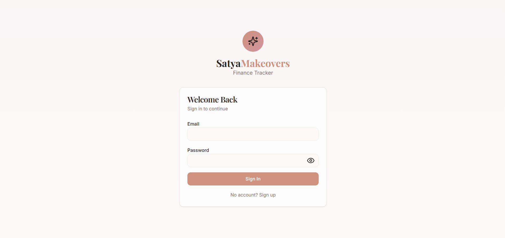
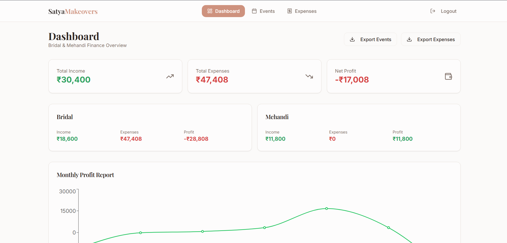
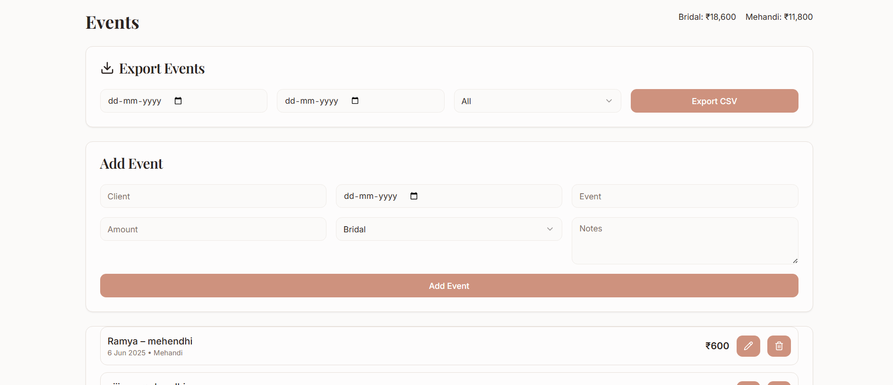
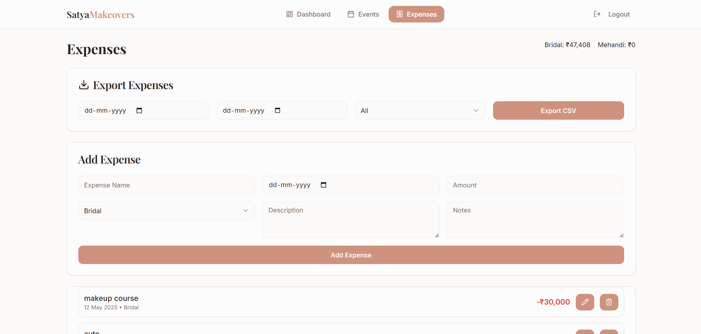
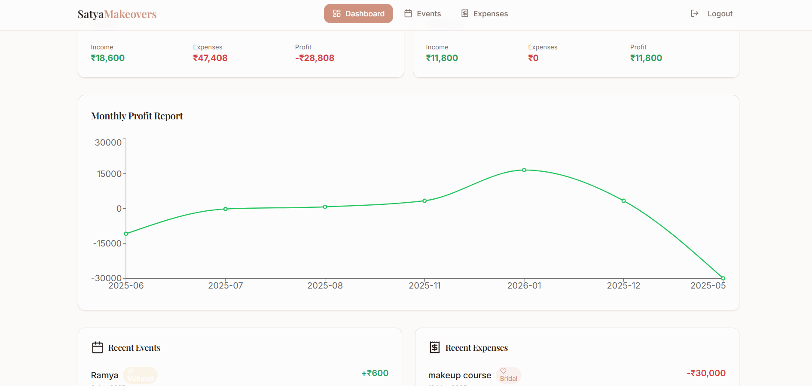

# Satya Makeovers – Finance Tracker
**Production-Grade Financial Management System for Service-Based Businesses**

Satya Makeovers – Finance Tracker is a **full-stack, production-ready financial management system** designed for small service-based businesses such as **Bridal & Mehandi studios**.  
The system delivers **secure data handling**, **accurate financial visibility**, and **automated reporting workflows** using **enterprise backend architecture**, **stateless JWT authentication**, and **scalable REST APIs**.

This project is engineered to reflect **real-world industry practices**, not a demo or academic exercise.


## 1. Problem Statement

Many small service-based businesses manage finances using spreadsheets, notebooks, or disconnected tools. This results in:

- Manual data entry and human errors  
- Inconsistent financial records  
- No authentication or access control  
- Poor visibility into profits and losses  
- Time-consuming manual report generation  

As the business scales, these limitations directly impact **decision-making, accountability, and growth**.


## 2. Solution Overview

Satya Makeovers – Finance Tracker provides a **centralized, secure, and automated financial system** that:

- Replaces manual tracking with structured data storage  
- Secures financial data using JWT-based authentication  
- Automates income, expense, and profit calculations  
- Provides real-time dashboards for financial insights  
- Generates downloadable CSV reports for audits and analysis  
- Scales cleanly using stateless REST APIs  


## 3. System Architecture

**Frontend**
- Single Page Application (SPA)
- Built with React for responsive and dynamic UI

**Backend**
- RESTful API using Spring Boot
- Clean separation of concerns (Controller, Service, Repository)

**Security**
- Stateless JWT authentication
- Spring Security filter chain
- Protected API routes

**Database**
- PostgreSQL relational database
- Structured schema with indexed relations

**Deployment**
- Dockerized backend
- Cloud deployment on Render


## 4. Technology Stack

### Frontend
| Technology | Purpose |
|----------|---------|
| React.js | UI framework |
| TypeScript | Type safety |
| Tailwind CSS | Responsive styling |
| Vite | Build tooling |

### Backend
| Technology | Purpose |
|----------|---------|
| Java Spring Boot | REST API development |
| Spring Security | Authentication & authorization |
| JWT | Stateless security |

### Database
| Technology | Purpose |
|----------|---------|
| PostgreSQL | Relational data storage |

### DevOps / Deployment
| Technology | Purpose |
|----------|---------|
| Docker | Containerization |
| Render | Cloud hosting |


## 5. Core Features

### Authentication & Authorization
- Secure user signup and login
- JWT-based stateless authentication
- Protected API endpoints
- Production-ready CORS configuration

### Event Management
- Create, update, delete Bridal & Mehandi events
- Track client details, service type, date, revenue, and notes
- Service-wise income classification

### Expense Management
- CRUD operations for expenses
- Categorization by service type
- Accurate operational cost tracking

### Financial Overview
- Total income calculation
- Total expense aggregation
- Net profit computation
- Recent activity summary

### Monthly Profit Analytics
- Month-wise profit calculation
- Income vs expense analysis
- Chart-based visualization

### CSV Reporting
- Export events and expenses as CSV
- Filters by date range and service type
- Auto-generated summary rows:
  - Bridal total
  - Mehandi total
  - Overall total


## 6. API Documentation (Summary)

### Authentication
- `POST /api/auth/signup`
- `POST /api/auth/login`

### Events (JWT Protected)
- `GET /api/events`
- `POST /api/events`
- `PUT /api/events/{id}`
- `DELETE /api/events/{id}`

### Expenses (JWT Protected)
- `GET /api/expenses`
- `POST /api/expenses`
- `PUT /api/expenses/{id}`
- `DELETE /api/expenses/{id}`

All non-auth endpoints require a valid JWT token.


## 7. Database Design (High-Level)

**Users**
- Authentication credentials
- Secure password storage

**Events**
- Service type, client, date, revenue
- Linked to users

**Expenses**
- Expense category, amount, date
- Linked to users

Relational integrity is enforced with foreign keys and indexed columns for performance.


## 8. Configuration & Environment Variables

The application uses **environment-based configuration** to ensure security and deployment flexibility.

```env
SPRING_DATASOURCE_URL
SPRING_DATASOURCE_USERNAME
SPRING_DATASOURCE_PASSWORD
JWT_SECRET
FRONTEND_ALLOWED_ORIGINS

```


** 9. Screenshots

### Login


### Dashboard


### Events Management


### Expenses Management


### Monthly Profit Analytics


### CSV Export


## 10. What This Project Demonstrates

- Enterprise-level backend development using **Spring Boot**
- Secure REST API design with **JWT-based authentication**
- Stateless authentication and authorization workflows
- Financial data aggregation and reporting logic
- Docker-based deployment and containerization strategy
- Clean and well-defined frontend–backend integration
- Maintainable, modular, and scalable system architecture

---

## 11. Ideal Use Cases

- Small service-based businesses (Bridal, Mehandi, Freelance services)
- Freelancers managing income and expenses
- Early-stage startups requiring basic financial tracking
- Financial tracking, analytics, and reporting systems

---

## 12. Live Demo

> **Note:** Backend is deployed on Render using Docker.  
> Free-tier hosting may cause cold starts.

- **Frontend (Live Application):**  
  👉 https://bridal-financetracker.vercel.app/

- **Backend API (Render):**  
  👉 https://satya-makeovers.onrender.com/


## 13. Author

**V.Satyanarayana**  
Full Stack Software Engineer  
Java • Spring Boot • REST APIs • React • PostgreSQL • Docker  
 
- LinkedIn: www.linkedin.com/in/satya-narayana-vasamsetti-0b161b2a0


